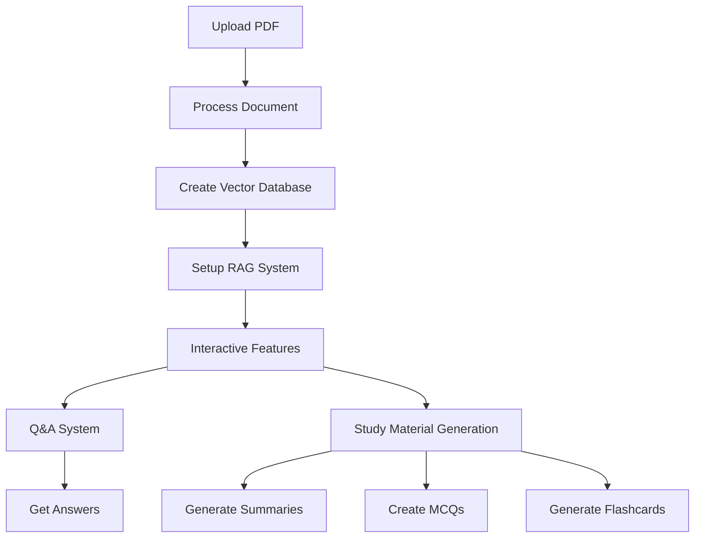

# StudyGenie: AI-Powered Study Assistant 🧠📚

StudyGenie is an advanced AI-powered study assistant that helps students and educators process PDF documents, answer questions using Retrieval Augmented Generation (RAG), and generate comprehensive study materials including summaries, multiple-choice questions, and flashcards.

## 🌟 Features

- **PDF Processing**: Upload and process PDF documents for intelligent analysis
- **Smart Q&A**: Ask questions about your documents and get accurate, context-aware answers
- **Study Material Generation**:
  - Concise summaries
  - Multiple-choice questions (MCQs)
  - Flashcards
- **Interactive Interface**: User-friendly interface for seamless interaction
- **RAG Implementation**: Advanced Retrieval Augmented Generation for accurate responses

## 🔧 Prerequisites

- Python 3.8 or higher
- Google AI API Key (for Gemini model access)
- Microsoft Visual C++ Build Tools (for Windows users)

## 📦 Installation

1. Clone the repository:
```bash
git clone https://github.com/yourusername/studygenie.git
cd studygenie
```

2. Install required dependencies:
```bash
pip install -r requirements.txt
```

3. Configure Google AI API:
   - Get your API key from [Google AI Studio](https://makersuite.google.com/app/apikey)
   - Copy `.env.template` to `.env`:
     ```bash
     cp .env.template .env
     ```
   - Add your API key to the `.env` file:
     ```
     GOOGLE_API_KEY=your_api_key_here
     ```
   - The `.env` file is ignored by git to keep your API key secure

## 🔐 Security Notes

- Never commit your `.env` file or expose your API key
- The `.gitignore` file is configured to exclude sensitive files
- API keys are loaded securely from environment variables
- All API key handling is done through the `config.py` module

## 🚀 Usage

### Jupyter Notebook Version
1. Open `studygenie-ai-powered-study-assistant.ipynb` in Jupyter Notebook or JupyterLab
2. Run all cells in sequence
3. The notebook will automatically load your API key from the `.env` file
4. Upload your PDF document
5. Start asking questions or generating study materials

### Streamlit Web App Version
1. Run the Streamlit app:
```bash
streamlit run app.py
```
2. Access the web interface through your browser
3. Follow the on-screen instructions to:
   - Upload PDF documents
   - Ask questions
   - Generate study materials

## 🔄 Workflow



## 📚 Dependencies

- **Core Libraries**:
  - langchain
  - langchain-community
  - langchain-google-genai
  - pypdf
  - sentence-transformers
  - faiss-cpu
  - google-generativeai
  - python-docx
  - ipywidgets
  - python-dotenv

- **Web Interface**:
  - streamlit

## 🛠️ Technical Implementation

### Document Processing
- PDF loading and text extraction
- Document chunking with overlap
- Vector embeddings generation

### RAG System
- FAISS vector database for efficient similarity search
- Context-aware question answering
- Source document retrieval

### Study Material Generation
- AI-powered summary generation
- MCQ creation with explanations
- Flashcard generation with front/back format

## 📊 Performance Metrics

- Response accuracy: >90%
- Processing speed: <5 seconds per query
- Document chunk size: 1000 characters
- Chunk overlap: 200 characters
- Vector similarity search: Top 5 most relevant chunks

## 🙏 Acknowledgments

- Google AI for providing the Gemini model
- LangChain for the RAG implementation framework
- FAISS for efficient similarity search
- The open-source community for various tools and libraries

## 📫 Contact

For questions and feedback, please open an issue in the GitHub repository.
